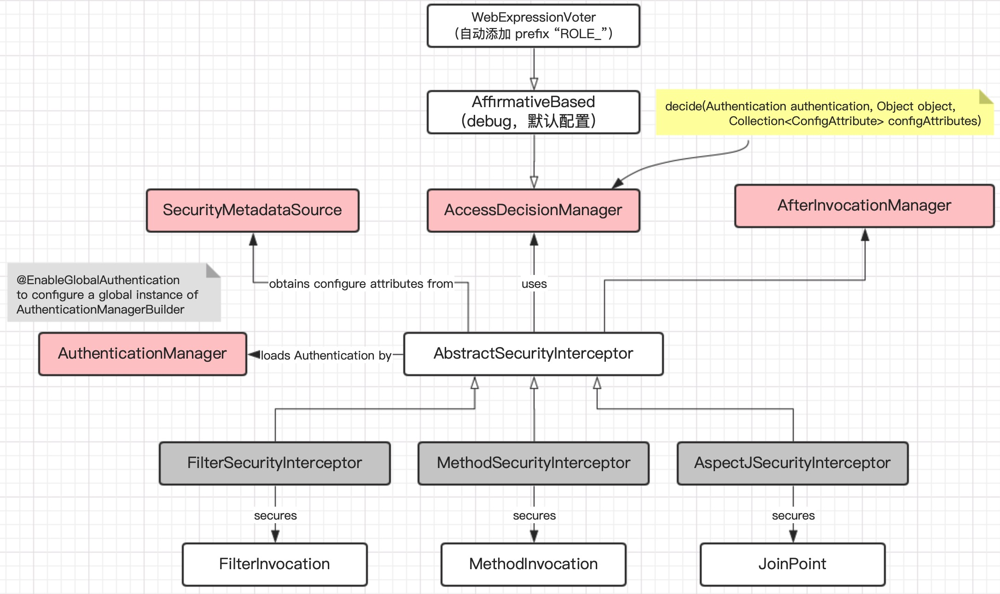

<!-- TOC -->

- [Spring boot log - Log4j2](#spring-boot-log---log4j2)
- [Redis](#redis)
    - [Redis Server](#redis-server)
        - [启动](#启动)
        - [停止](#停止)
        - [命令行](#命令行)
        - [配置](#配置)
        - [最基本的命令](#最基本的命令)
    - [Jedis - a Java Client](#jedis---a-java-client)
    - [Spring Data Redis](#spring-data-redis)
        - [RedisTemplate](#redistemplate)
    - [Spring Boot Redis](#spring-boot-redis)
- [Spring Security](#spring-security)
    - [Authorization](#authorization)
        - [**Set Authentication**](#set-authentication)
        - [**Basic abstraction**](#basic-abstraction)
        - [**Workflow**](#workflow)
- [Activiti](#activiti)
    - [如何建表](#如何建表)

<!-- /TOC -->

# Spring boot log - Log4j2


# Redis 


## Redis Server

### 启动  
```
$ redis-server
$ /usr/local/redis-5.0.5/src/redis-server
```

### 停止  
```
Ctrl+C  
$ reids-cli
$ shutdown
$ quit
```


### 命令行  
```
$ redis-cli -h host -p port
$ AUTH password
$ QUIT
```  

### 配置 
+ 配置文件  
{redis_home}/redis.conf  
+ 默认配置  
port 6379

### 最基本的命令

+ 
```
DBSIZE
KEY pattern
TYPE key
```

+ String type operations

+ Hash type operations


## Jedis - a Java Client


## Spring Data Redis
+ Dependencies

+ Inject RedisTemplate

### RedisTemplate


## Spring Boot Redis
+ Dependencies  
spring-boot-starter-data-redis

+ application.yml
```yml
spring:
    redis:
        host: localhost
        port: 6379
        database: 1
```
+ 


# Spring Security 


## Authorization

### **Set Authentication**

The only critical requirement is that the <span style="color:blue">SecurityContextHolder
contains an Authentication</span> **before the AbstractSecurityInterceptor**
needs to authorize a user operation

+ GrantedAuthority  
`String getAuthority();`  
SimpleGrantedAuthority(an impl)

### **Basic abstraction**
1. 3 ways:   
secure method invocations(spring AOP),  
secure domian object(AspectJ),  
web request autorization(Filter)
1. Secure objects
1. Inteceptor class 
1. configurati0n attributes 

### **Workflow**




# Activiti

## 如何建表


